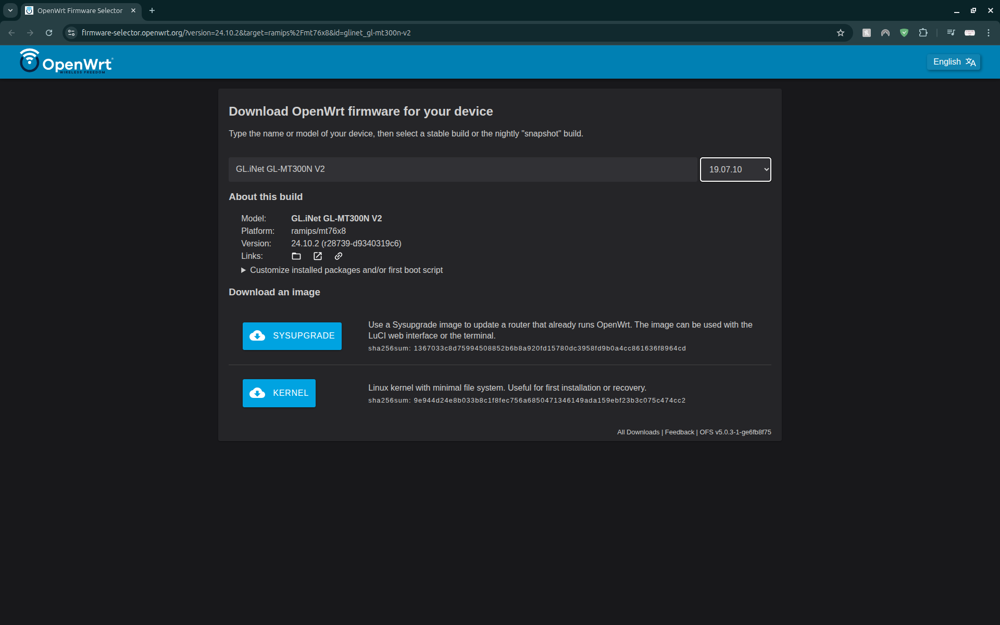

Disclaimer: Hak5 (the creators of the WiFi pineapple) are a hardware company. They have their own proprietary firmware but the software is open source, and largely based on other people’s open source tools. Thus, we can bring our own hardware, use OpenWrt as our firmware and port Hak5’s software without stepping on any toes. 

<h3>Equipment:</h3>
<ul>
    <li>GL-MT300N-V2, aka the Mango (or another compatible router from here: https://github.com/xchwarze/wifi-pineapple-cloner/blob/master/devices.md)</li>
    <li>USB A hub – at least three extra ports</li>
    <li>USB flash drive</li>
    <li>2 USB antennas with compatible WiFi chipsets (listed here: https://github.com/SHUR1K-N/wifi-mangoapple-resources#chipsets , I used chipset RT5572)</li>
    <li>a device with an Ethernet port (for sshing into the Mango)</li>
    <li>(optional) a portable power source, otherwise you can just plug it into your computer to power it</li>
</ul>

<h3>Setup Instructions:</h3>
<ol>
    <li>Start by connecting you USB flash drive and your antennas to the hub. Make note of which component is in each port as this needs to remain consistent throughout usage.
    
    </l1> 
</ol>

<h4>Software/Firmware Download</h4>
Either
<ol>
    <li>go to https://github.com/Anneliese-Menday/Wifi-Mango-or-DIY-Wifi-Pineapple and download gl-mt300n-v2-universal-sysupgrade.bin (the pineapple port) and openwrt-19.07.10-ramips-mt76x8-gl-mt300n-v2-squashfs-sysupgrade.bin</li>
</ol>
or
<ol>
    <li>go to https://gitlab.com/xchwarze/wifi-pineapple-cloner-builds find the router you are using and download the 19.07.7 version – this is the Pineapple cloner</li>
    <li>go to https://firmware-selector.openwrt.org/ put in the name of the router you are using and select the oldest firmware possible. Since 19.07.7 has been deprecated we want to use something as close as possible. For me that was 19.07.10.
    
    </li>
</ol>


<h4>Software/Firmware Instillation</h4>
<ol>
    <li>Next we need to replace the firmware on our Mango with the OpenWrt firmware we downloaded in the previous step. If you are using a GL-MT300N-V2 follow the instructions for a U-boot here: https://docs.gl-inet.com/router/en/4/faq/debrick/ and when prompted select the firmware we downloaded. Note the update page won’t change once its finished updating, you need to look at the Mango fo the lights to go solid. Do not do step 8. If you are using a different router you will need to go through its instructions to find out how to change the firmware.</li>
    <li>Go to 192.168.8.1</li>
    <li>It will prompt you to set a password, pick something you will not forget as there is no recovery option (other than fully wiping the router and starting again)</li>
    <li>Then go to System → Backup/Flash Firmware</li>
    <li>Click on Flash image at the bottom under “Flash new firmware image”</li>
    <li>Select the Pineapple port. For GL-MT300N-V2 users it is called  gl-mt300n-v2-universal-sysupgrade.bin. Then click upload and wait for it to finish uploading.</li>
    <li>Then a “Flash Image?” dialogue box will appear. Uncheck “Keep settings and retain the current configuration” and then click continue.</li>
    <li>This will take about 3 minutes. The page will not updated when completed. Wait for all the LEDs on the Mango to go solid. (The WiFi LED might still be flickering a little, this is okay)</li>
    <li>If you changed the IP address back in step one of this section, you can revert it now/change it back to obtain automatically.</li>
</ol>

<h4>Initial WiFi Pineapple Setup</h4>
<ol>
    <li>Make sure the Mango is connected to your computer via its LAN port and powered on.</li>
    <li>Go to 172.16.42.1:1471, this is the IP address for the WiFi Pineapple Tetra interface</li>
    <li>Click get started, then continue</li>
    <li>The window will change to “Secure Setup”. Plug your USB hub (with the antennas and flash drive connected to it) into the Mango BEFORE clicking the reset button once. The message should go away.</li>
    <li>Then it will take you to a config page. You need to at least set your root password (again no recovery option other than wiping and restarting). Everything else can be changed later if you want. But, I recommend setting up the management AP, changing the country, and changing the timezone. Scroll to the bottom and check the accept boxes and then click complete setup.</li>
    <li>Login with the root password you just set</li>
    <li>You are now at the pineapple dashboard, we are going to do a few checks to make sure everything is working properly before continuing</li>
    <li>Go to the advanced tab (its on the left)</li>
    <li>Then click refresh in the USB & Storage view
        
    </li>
    <li>You should be able to see both of your antennas with their chipset. Check the chipset is correct, it is not uncommon for devices to come with the wrong chipset. You should also be able to see your flash drive. If anything is not showing up try going to Configuration → General → Factory Reset Pineapple and repeating this section</li>
    <li>If the above step went well, go to Recon and hit scan. Wait for a minute or two and then end the scan and load up the log. The page should become populated with data. See How to Use Wifi Pineapple → Recon for more information.</li>
</ol>

<h4>Connecting to the Internet</h4>
<ol>
    <li>Go to Networking → WiFi Client Mode</li>
    <li>Here you will need to select an interface. WLAN 1 is used for PineAP (which does all the cool stuff) so change it to WLAN 2 and click scan
        
    </li>
    <li>Then select your Wifi network, fill in the password and hit connect.
        
        Sometimes you have to do it 2-3 times. I don’t know why. So if it doesn't work the first time try it a couple more times. Also note that it can NOT connect to protocol 5 or 6 WiFi networks. This is because the Pineapple Tetra/Nano (the code we are using) was discontinued in 2019. It can see the WiFi 5 and 6 networks, it just can’t interact with them in any way.
        
    </li>
    <li>To check it is working, go to Dashboard and hit Load Project News!. If it loads in, you have internet. You will need internet for the next section
        
    </li>
</ol>

<h4>SSHing into the Mango</h4>
<ol>
    <li>Go to your terminal and run
        ```
        ssh-keygen -R Pineapple
        ```
        this only needs to happen the first time (if you do not already have ssh installed you will need to install it)
    </li>
    <li></li>
    <li></li>
    <li></li>
    <li></li>
    <li></li>
    <li></li>
    <li></li>
    <li></li>
    <li></li>
    <li></li>
    <li></li>
</ol>

    1. Go to your terminal and run
       ssh-keygen -R Pineapple
       this only needs to happen the first time (if you do not already have ssh installed you will need to install it)
    2. Then run 
       ssh root@Pineapple
       You should now be “in” the Mango
    3. Now we need to format the USB. Run the command
       wpc-tools format_sd
       It will take a while, so don't panic
    4. Then run
       cd /sd/
       To go into the flash drive
    5. Run
       ls
       This will list all the directories currently in the drive. Technically, there shouldn’t be anything since we haven't put anything on it yet. But, sometimes there are some automatically created files. 
    6. Run
       rm -r *
       To delete everything on the drive. Then check by running ls again. If there are still files repeat this step until nothing shows up.
    7. Then go back a directory by running
       cd ../
    8. Then we are going to install the missing packages. This will allow us to do things like continuous scan in recon (instead of starting, stopping and loading) and some other stuff. Run
       wpc-tools missing_packages
       This will take a while, don’t panic.
    9. There will be a few python things that “Can’t list”, this is fine. So long as it says Install Complete! At the bottom we are all good
    10. To check it works go back to recon and start a continuous scan and hit refresh in the upper right a couple times. If stuff loads in, congratulations, everything is working
    11. While we are here change the scans location to “/sd/” and hit set since the Mango doesn’t have a lot of internal storage. The scan file is called “recon.db” and will appear in the drive.


    <li></li>
    <li></li>
