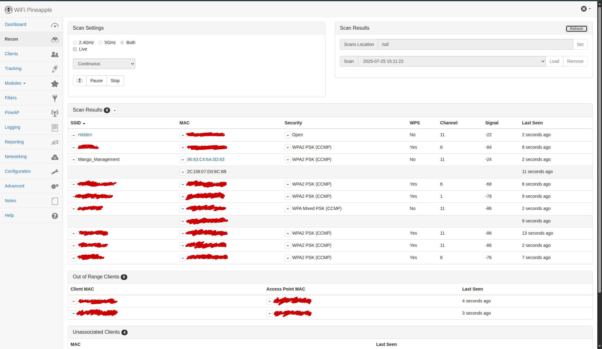
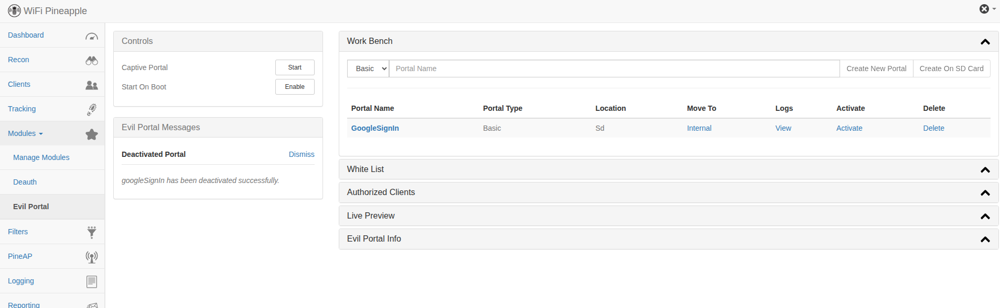

Disclaimer: Hak5 (the creators of the WiFi pineapple) are a hardware company. They have their own proprietary firmware but the software is open source, and largely based on other people’s open source tools. Thus, we can bring our own hardware, use OpenWrt as our firmware and port Hak5’s software without stepping on any toes. 

<h3>Equipment:</h3>
<ul>
    <li>GL-MT300N-V2, aka the Mango (or another compatible router from here: https://github.com/xchwarze/wifi-pineapple-cloner/blob/master/devices.md)</li>
    <li>USB A hub – at least three extra ports</li>
    <li>USB flash drive</li>
    <li>2 USB antennas with compatible WiFi chipsets (listed here: https://github.com/SHUR1K-N/wifi-mangoapple-resources#chipsets , I used chipset RT5572)</li>
    <li>a device with an Ethernet port (for sshing into the Mango)</li>
    <li>(optional) a portable power source, otherwise you can just plug it into your computer to power it</li>
</ul>

<h3>Setup Instructions:</h3>
<ol>
    <li>Start by connecting you USB flash drive and your antennas to the hub. Make note of which component is in each port as this needs to remain consistent throughout usage.
    
    </l1> 
</ol>

<h4>Software/Firmware Download</h4>
Either
<ol>
    <li>go to https://github.com/Anneliese-Menday/Wifi-Mango-or-DIY-Wifi-Pineapple and download gl-mt300n-v2-universal-sysupgrade.bin (the pineapple port) and openwrt-19.07.10-ramips-mt76x8-gl-mt300n-v2-squashfs-sysupgrade.bin</li>
</ol>
or
<ol>
    <li>go to https://gitlab.com/xchwarze/wifi-pineapple-cloner-builds find the router you are using and download the 19.07.7 version – this is the Pineapple cloner</li>
    <li>go to https://firmware-selector.openwrt.org/ put in the name of the router you are using and select the oldest firmware possible. Since 19.07.7 has been deprecated we want to use something as close as possible. For me that was 19.07.10.
    
    </li>
</ol>

<h4>Software/Firmware Instillation</h4>
<ol>
    <li>Next we need to replace the firmware on our Mango with the OpenWrt firmware we downloaded in the previous step. If you are using a GL-MT300N-V2 follow the instructions for a U-boot here: https://docs.gl-inet.com/router/en/4/faq/debrick/ and when prompted select the firmware we downloaded. Note the update page won’t change once its finished updating, you need to look at the Mango fo the lights to go solid. Do not do step 8. If you are using a different router you will need to go through its instructions to find out how to change the firmware.</li>
    <li>Go to 192.168.8.1</li>
    <li>It will prompt you to set a password, pick something you will not forget as there is no recovery option (other than fully wiping the router and starting again)</li>
    <li>Then go to System → Backup/Flash Firmware</li>
    <li>Click on Flash image at the bottom under “Flash new firmware image”</li>
    <li>Select the Pineapple port. For GL-MT300N-V2 users it is called  gl-mt300n-v2-universal-sysupgrade.bin. Then click upload and wait for it to finish uploading.</li>
    <li>Then a “Flash Image?” dialogue box will appear. Uncheck “Keep settings and retain the current configuration” and then click continue.</li>
    <li>This will take about 3 minutes. The page will not updated when completed. Wait for all the LEDs on the Mango to go solid. (The WiFi LED might still be flickering a little, this is okay)</li>
    <li>If you changed the IP address back in step one of this section, you can revert it now/change it back to obtain automatically.</li>
</ol>

<h4>Initial WiFi Pineapple Setup</h4>
<ol>
    <li>Make sure the Mango is connected to your computer via its LAN port and powered on.</li>
    <li>Go to 172.16.42.1:1471, this is the IP address for the WiFi Pineapple Tetra interface</li>
    <li>Click get started, then continue</li>
    <li>The window will change to “Secure Setup”. Plug your USB hub (with the antennas and flash drive connected to it) into the Mango BEFORE clicking the reset button once. The message should go away.</li>
    <li>Then it will take you to a config page. You need to at least set your root password (again no recovery option other than wiping and restarting). Everything else can be changed later if you want. But, I recommend setting up the management AP, changing the country, and changing the timezone. Scroll to the bottom and check the accept boxes and then click complete setup.</li>
    <li>Login with the root password you just set</li>
    <li>You are now at the pineapple dashboard, we are going to do a few checks to make sure everything is working properly before continuing</li>
    <li>Go to the advanced tab (its on the left)</li>
    <li>Then click refresh in the USB & Storage view
        
    </li>
    <li>You should be able to see both of your antennas with their chipset. Check the chipset is correct, it is not uncommon for devices to come with the wrong chipset. You should also be able to see your flash drive. If anything is not showing up try going to Configuration → General → Factory Reset Pineapple and repeating this section</li>
    <li>If the above step went well, go to Recon and hit scan. Wait for a minute or two and then end the scan and load up the log. The page should become populated with data. See How to Use Wifi Pineapple → Recon for more information.</li>
</ol>

<h4>Connecting to the Internet</h4>
<ol>
    <li>Go to Networking → WiFi Client Mode</li>
    <li>Here you will need to select an interface. WLAN 1 is used for PineAP (which does all the cool stuff) so change it to WLAN 2 and click scan
        
    </li>
    <li>Then select your Wifi network, fill in the password and hit connect.
        
        Sometimes you have to do it 2-3 times. I don’t know why. So if it doesn't work the first time try it a couple more times. Also note that it can NOT connect to protocol 5 or 6 WiFi networks. This is because the Pineapple Tetra/Nano (the code we are using) was discontinued in 2019. It can see the WiFi 5 and 6 networks, it just can’t interact with them in any way.
        
    </li>
    <li>To check it is working, go to Dashboard and hit Load Project News!. If it loads in, you have internet. You will need internet for the next section
        
    </li>
</ol>

<h4>SSHing into the Mango</h4>
<ol>
    <li>Go to your terminal and run
        <code>ssh-keygen -R Pineapple</code>
        this only needs to happen the first time (if you do not already have ssh installed you will need to install it)
    </li>
    <li>Then run 
       <code>ssh root@Pineapple</code>
       You should now be “in” the Mango
    </li>
    <li>Now we need to format the USB. Run the command
       <code>wpc-tools format_sd</code>
       It will take a while, so don't panic
    </li>
    <li>Then run
       <code>cd /sd/</code>
       To go into the flash drive
    </li>
    <li>Run
       <code>ls</code>
       This will list all the directories currently in the drive. Technically, there shouldn’t be anything since we haven't put anything on it yet. But, sometimes there are some automatically created files. 
    </li>
    <li>Run
       <code>rm -r *</code>
       To delete everything on the drive. Then check by running ls again. If there are still files repeat this step until nothing shows up.
    </li>
    <li>Then go back a directory by running
       <code>cd ../</code>
    </li>
    <li>Then we are going to install the missing packages. This will allow us to do things like continuous scan in recon (instead of starting, stopping and loading) and some other stuff. Run
       <code>wpc-tools missing_packages</code>
       This will take a while, don’t panic.
    </li>
    <li>There will be a few python things that “Can’t list”, this is fine. So long as it says Install Complete! At the bottom we are all good</li>
    <li>To check it works go back to recon and start a continuous scan and hit refresh in the upper right a couple times. If stuff loads in, congratulations, everything is working</li>
    <li>While we are here change the scans location to “/sd/” and hit set since the Mango doesn’t have a lot of internal storage. The scan file is called “recon.db” and will appear in the drive.</li>

</ol>

<h4>Extra Stuff</h4>
<ol>
    <li>Go to Modules → Manage Modules and select Get Modules. A long list of available modules should appear. The github repos are also availble here: https://github.com/hak5/nano-tetra-modules/tree/master 
        
    </li>
    <li>You can install whatever modules you want, but for my attack you will need the Death module by whistlemaster and the Evil Portal module by newbi3</li>
    <li>When you click install it will ask you if you want to install it internally or to SD Card (i.e. the flash drive). I recommend the flash drive. This can easily be changed later by going back the Manage Modules and removing the module and then reinstalling it in your preferred location.
        
    </li>
    <li>Some modules require additional dependencies. Simply select the button that installs them and again, I recommend putting them on the flash drive.</li>
    <li>Go to Networking and select Download OUI Database. This will help us to identify devices by their mac address. For further detail check out “How to Use Wifi Pineapple”.</li>
    <li>Turn off the Mango (simply disconnect it from the power) and plug the USB flash drive directly into your computer.</li>
    <li>Then go to https://github.com/Anneliese-Menday/Wifi-Mango-or-DIY-Wifi-Pineapple and download the googleSignIn folder</li>
    <li>Then copy the downloaded folder and all of its contents into the portals folder of the USB flash drive. This will require admin/sudo privileges. The following steps are for an Ubuntu based system, if you are using something else the process will be different.
        <ol>
            <li>Open the terminal</li>
            <li>Run
                <code>sudo cp -a /source/ . /dest/</code>
                where source is the googleSignIn folder path including /googleSignIn at the end and /dest/ is /your USB name/portals/</li>
            <li>it will prompt you to fill in your password</li>
            <li>Check it has copied over properly</li>
            <li>Eject drive safely and plug it back into the USB hub in the SAME port it was plugged into before</li>
        </ol>
    </li>
</ol>

<h2>How to Use the WiFi Pineapple</h2>
<h4>Recon</h4>
This view is used to passively scan for near-by WiFi signals. It is similar to the Bluetooth week 1 exercise. To use it set scan settings to both, then select start, start PineAP, and hit the refresh button on the right until you see something. Mine looks like this:

The signal is measured in decibels and WPS is just an old security protocol that some devices no longer support. 

SSID stands for Service Set Identifier, it is essentially the name of the WiFi network/access point. On mine you can see Mango_Management, the name of my Mango router. 

MAC stands for Media Access Control. It is an address that identifies your hardware. Your phone, laptop, speakers, etc. all have their own MAC address. For this reason it is also called a hardware address. It is assigned by the hardware vendor according to IEEE standards. Since it can be used to identify devices it is common for devices like phones and computers to hid their real MAC address, this is called spoofing. 

You might notice that Mango_Management appears to have two MAC addresses. This is not the case. The light blue one is the MAC address of the router and the one below it is the MAC address of my laptop. My laptop is listed with Mango_Management because it is connected via WiFi to it. If we stop the scan and then click the arrow next to my laptop’s MAC address we get this view.

PineAP Filter and PineAP Tracking are simple tools used to help keep track of devices and include or exclude them from particular attacks. You can add MAC addresses to them from this view or by going to their dedicated views on the left. We will go over Deauth in a moment but for now just know the Deauth in this view is not especially useful. 

Then we have OUI. This is why we downloaded the database earlier. The first three pairs of hex numbers in a MAC address are used to identify the hardware vendor, the OUI is a database of these and can be used to help identify a device. In my case 2C:DB:07 is the start of the MAC address. This matches with Intel, which checks out since my laptop is an Intel device. You can also look up MAC addresses manually be going to Network → OUI Lookup.

<h4>PineAP</h4>
There’s a lot going on in this view so we will go through each section one at a time. Configuration section first.
<ul>
    <li>Allow Associations - controls wether or not other devices can connect to the Mango, for our attack we will want this ticked.</li>
    <li>Log PineAP Events – controls wether or not events are logged</li>
    <li>Client Connect Notifications – an event we can tell it to log</li>
    <li>Client Disconnect Notifications – an event we can tell it to log</li>
    <li>Capture SSIDs to Pool – SSIDs are WiFi network/Access Point names. When this option is ticked the Mango will scan for nearby access points and collect their SSIDs to the pool. The pool is just a list of these captured SSIDs.</li>
    <li>Beacon Response – sends target beacons to Client devices in response to the Client devices probe request. We need this ticked for our attack</li>
    <li>Broadcast SSID pool – broadcasts access points that have the same name as legitimate nearby access points but that actually connect the Client device to the mango. We need this ticked for out attack.</li>
    <li>PineAP Daemon – for turning PineAP on/off. Can only use WLAN 1.</li>
</ul>
I suggest not messing with the other settings unless you know what you are doing. We don’t need to touch them for our attack.

The SSID pool is, as described above, a list of nearby SSIDs. However, you can add your own custom SSIDs and remove SSIDs you don’t want for a more targeted attack. The purpose of the pool is for a more social engineering based attack, it does not itself actually “hack” anything. It is entirely reliant on tricking an unsuspecting user into connecting. 

PineAP enterprise is just a hang over from before it was deprecated. You can just ignore it.

Captured WPA Handshakes does not work with the Mango. Essentially the internal file structure of the Mango is incompatible with this feature. I have not found a solution but it is not necessary for the attack we wish to execute.

Inject Raw Frames is for creating your own data packets to send to devices over WiFi. All data packets in the WiFi protocol are called frames. Beacon Response and Deauth attacks are conducted by sending frames over the network and tricking devices into doing things based on the frame sent. This section allows you to create your own attacks rather than using the pre-made attacks.

<h4>Deauth</h4>
A Deauth or de-authorisation attack is a frame injection attack whereby we trick a target device into thinking the access point it is connected to no-long wants to connect. To explain lets quickly go over how a client connects to an access point.
<ol>
    <li>The access point (e.g. a router) sends out beacon frames. This is essentially advertising the existence of the access point. It includes some information like SSID, protocol, supported data rates, etc. Essentially all the information needed for a client to connect.</li>
    <li>The client sends out probe requests to access points. It can either send out a general probe to every access point in the vicinity asking “Are there any access points?” or it can send a probe to a specific SSID asking “Are you nearby?”. The access points then respond with all the information in the beacon frame.</li>
    <li>Once the client has decided who they want to connect to they send an association request and, if successful, receives a positive association response. Essentially “Want to be friends?”, “Yes we can be friends”.</li>
    <li>The final step is authentication. There are a few different schemes for authentication, the precise type is irrelevant, just know it is required for all access points.</li>
</ol>
An access point is entitled to withdraw authentication at any point and disconnect the client. This is what a deauth attack exploits. We create a frame that appears to be coming from the client’s connected access point that more or less says “I don’t want to be friends anymore”, thus tricking the client into disconnecting.

However, there is a problem. Most modern devices have auto-connect to WiFi capabilities. So as soon as it disconnects from the access point it goes through its list of known access points and tries to reconnect to one of them (this can be used to trick the client into connecting to an unsafe WiFi network that has the same SSID as a known safe network), possibly even the one it just disconnected from! So if we want to actually block a client from connecting to a particular access point we must continually send de-authentication frames for the duration we want to block the connection.

This is why the deauth button in the recon view isn't very useful. In all likelihood the client will just immediately reconnect. Enter the Deauth module. This module sends deauth frames continuously, allowing you to actually block the connection.

It is VERY IMPORTANT to note here that Deauth attacks are super illegal to do to people without their consent. Due to this you must only ever use black list mode (i.e. the mode where you list the networks you want to attack) and not white list mode (i.e. the mode where you attack everyone except the people on your list).

Below is a picture of the Deauth module with all of its sections expanded. If it isn’t showing up make sure you have clicked to install the dependencies and then refresh.

In the setting section we need to make sure it is set to blacklist mode. We don’t need to specify a speed so just leave it as false. We do need to specify a channel. The channel should match the channel of the access point we are trying to block. You can find out the access points channel in the recon view.

In the editor section we can either scan for nearby access points to add to our list or we can directly type the MAC address of the access point into the Blacklist. Don’t forget to hit save!

Once we have set these two sections up we can start our Deauth attack. If it isn’t working try changing the mdk3 option. Please not that it will not be able to do Deauth attacks on access points running WiFi 5 or 6. They will come up in the scan but it is unable to create frames for those protocols. This isn’t because 5 or 6 have better security, it just hasn’t been updated since 2019. Also note that if you launch a Deauth attack on the access point that the Mango is connected to then the Mango will also be disconnected. The Deauth module targets all devices connected to a particular access point, including the Mango.

<h4>EvilPortal</h4>
The purpose of an evil portal is to create a realistic looking replica of someone else’s sign in  page (e.g. Google, Facebook, Microsoft, etc.) and then direct traffic towards it, thus tricking people into handing over their credentials. This particular Evil portal module is to capture the credentials of people attempting to access free WiFi.

If you have ever accessed free WiFi at a hotel or shopping centre you may have noticed that before being given access to the internet you are redirected a page that requires you to hand over your email address or phone number, maybe your room number etc. This is the sort of process that is exploited by this module.

When a person attempts to connect to your Mango they will be redirected to the sign in page you will setup using Evil Portal, then, when they log in, you will save the credentials they used. This is not in itself “evil”. The “Evil” part of the name comes from you making your portal look like, say, the google sign in page. So instead of giving you their email address and calling it a day, they give you the password to their google account.

Let’s go over how to use the module. You should have already downloaded my google sign in and put it on the flash drive of your Mango. If you have the Evil portal module should look like the image below. If you haven’t already added it go to step 7 of Extra Stuff.

In the white list you can add the MAC addresses of devices that never need to authenticate themselves through the portal before accessing the internet. Often the device you are using to control the Mango will be automatically added to this list. You can add and remove any MAC address you like.

The authorised clients list is a list of the MAC addresses of the clients who have already gone through the portal and handed over their sign in details. Again, you can remove clients to make them go through the portal again if you wish.

The Live Preview section will show you what the clients will see when they are redirected to your sign in page.

To activate the GoogleSignIn portal click activate and then click start portal. The captured credentials will be saved temporarily in the logs and permanently on the USB stick in a txt file called googleSignIn.

If you want to create your own portals you can do so by typing a name in the portal name section of the workbench and clicking create on SD card. This will create the default portal which you can then edit to be whatever you want it to be. I don’t recommend writing the code for your web page here as its just a plain text editor. Instead it will be easier to imitate the structure of the googleSignIn folder in something like vscode, create your webpage there, and then follow the instruction given in Extra Stuff step 7 to put it directly on your USB drive.

<h2>My Attack</h2>
<ol>
    <li>Recon to find an access point to target</li>
    <li>Capture SSID of access point to the pool and broadcast them</li>
    <li>Deauth the real access point</li>
    <li>Direct traffic to my fake google sign in page</li>
    <li>Steal people’s google sign in</li>
</ol>
Below are some photos of the fake google sign in page on Chrome, Firefox and an android phone.

